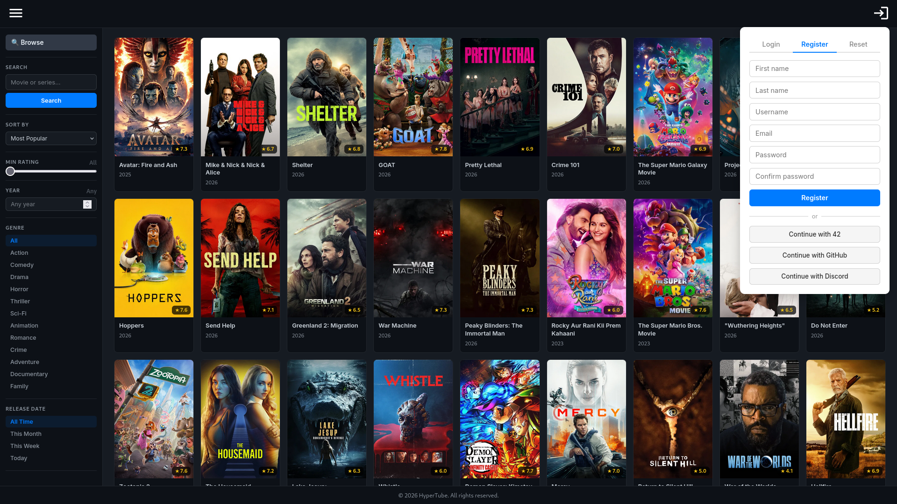
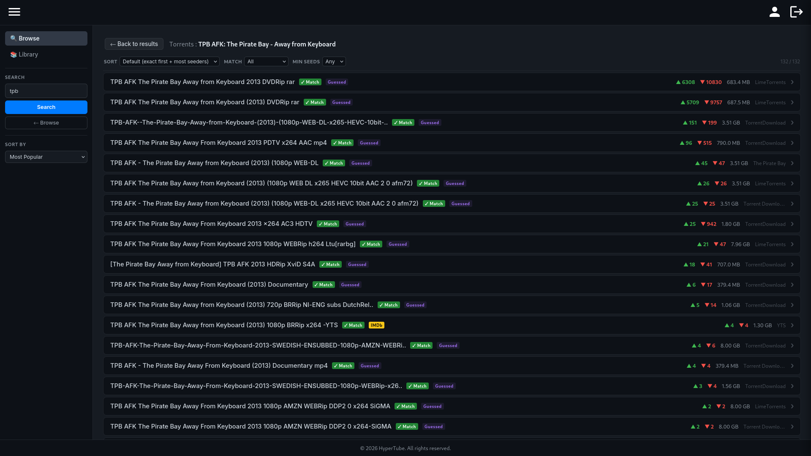
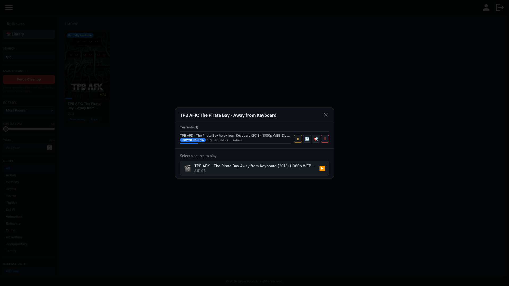
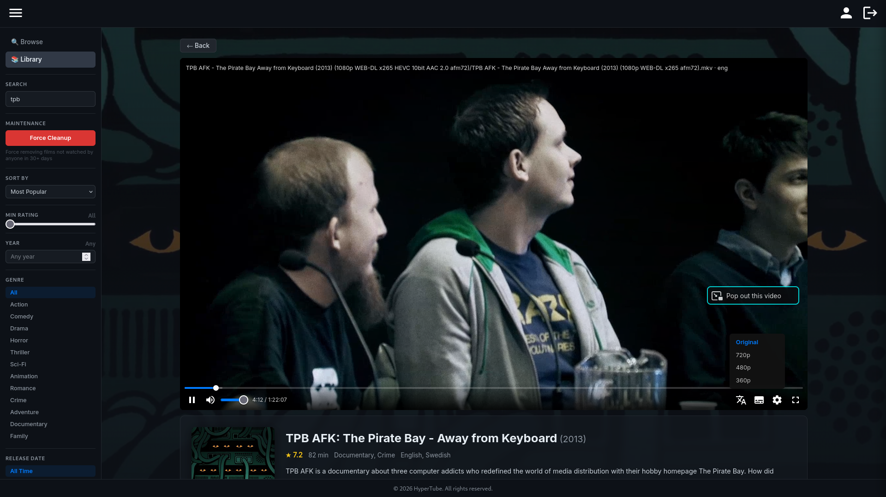
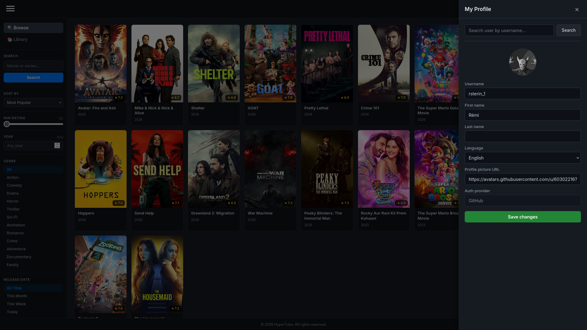
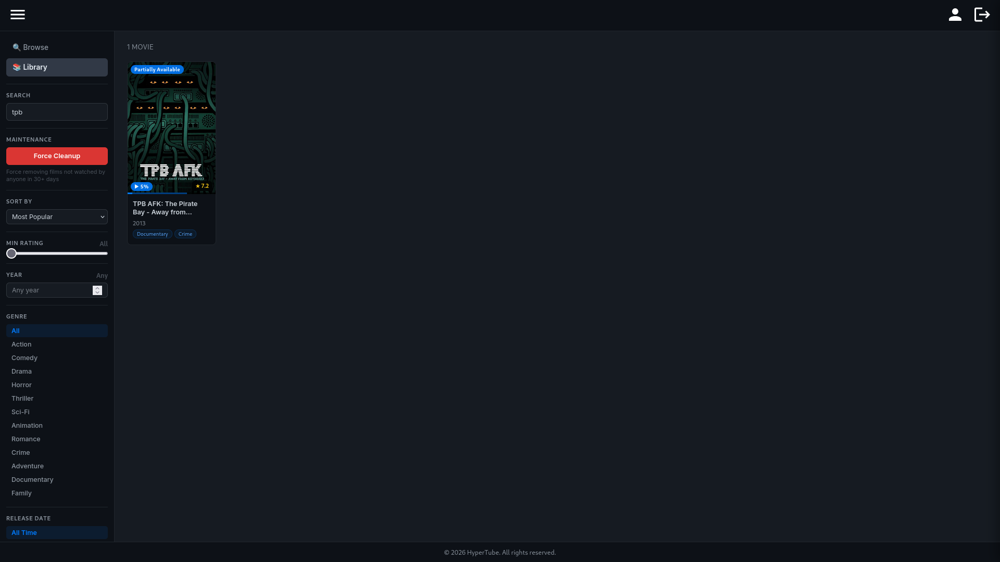

<div align="center">

# HyperTube


**A Netflix-like streaming platform that searches, downloads, and plays torrents directly in the browser.**

<br>



</div>

---

<details>
<summary><strong>Table of Contents</strong></summary>

- [About](#about)
- [Features](#features)
- [Tech Stack](#tech-stack)
- [Getting Started](#getting-started)
- [Usage](#usage)

</details>

## About

HyperTube is a full-stack web application that lets users browse movies from TMDB, search for torrents across multiple indexers via Jackett, download them through qBittorrent, and stream video directly in the browser — all from a single interface. Films not watched within 30 days are automatically cleaned up to free disk space.

This is a [42](https://42.fr) school project.

## Features

- **Browse & search** — discover movies powered by [TMDB](https://www.themoviedb.org/) with filters for genre, year, rating, and release date
- **Torrent aggregation** — search torrents across 20+ indexers via [Jackett](https://github.com/Jackett/Jackett) with seeder/leecher stats and source info
- **In-browser streaming** — watch videos directly in a custom player with multiple resolution options (Original, 720p, 480p, 360p)
- **Subtitles** — automatic subtitle fetching via [SubDL](https://subdl.com/)
- **OAuth authentication** — sign in with 42, GitHub, or Discord alongside classic email registration
- **Personal library** — track downloaded films, monitor download progress, and manage torrents
- **User profiles** — edit username, name, language, and profile picture
- **Auto-cleanup** — unwatched films are automatically removed after 30 days

<details>
<summary><strong>Screenshots</strong></summary>

<br>

| Torrent search | Torrent download |
|:-:|:-:|
|  |  |

| Video player | Profile |
|:-:|:-:|
|  |  |

| Library |
|:-:|
|  |

</details>

## Tech Stack

| Component        | Technology                                                     |
|:-----------------|:---------------------------------------------------------------|
| Frontend         | [React](https://react.dev/)                                    |
| Backend          | [FastAPI](https://fastapi.tiangolo.com/)                       |
| Database         | [PostgreSQL](https://www.postgresql.org/)                      |
| Torrent indexer  | [Jackett](https://github.com/Jackett/Jackett)                  |
| Torrent client   | [qBittorrent](https://www.qbittorrent.org/)                    |
| Movie data       | [TMDB API](https://www.themoviedb.org/)                        |
| Subtitles        | [SubDL API](https://subdl.com/)                                |
| Infra            | [Docker](https://www.docker.com/)                              |

## Getting Started

### Prerequisites

| Tool                                              | Version |
|:--------------------------------------------------|:--------|
| [Docker](https://docs.docker.com/get-docker/)     | ≥ 20.x  |
| [Docker Compose](https://docs.docker.com/compose/)| ≥ 2.x   |
| Make                                              | —       |

### Installation

```bash
git clone https://github.com/rsterin/HyperTube.git
cd HyperTube
```

### Build & Run

```bash
make
```

This starts five services: **frontend**, **backend**, **database**, **jackett**, and **torrent-client**.

### Verify

Open [http://localhost:8081](http://localhost:8081) — register an account or sign in with OAuth to start browsing.

## Usage

1. **Browse** — explore movies from the sidebar with genre, year, and rating filters
2. **Search torrents** — click a movie to search available torrents ranked by seeders and source
3. **Download** — select a torrent to start downloading; track progress with speed and ETA in real time
4. **Stream** — hit play once the download begins — streaming starts immediately, no need to wait for completion
5. **Switch resolution** — choose between Original, 720p, 480p, or 360p from the player settings
6. **Library** — switch to the Library tab to see all downloaded films and manage storage
